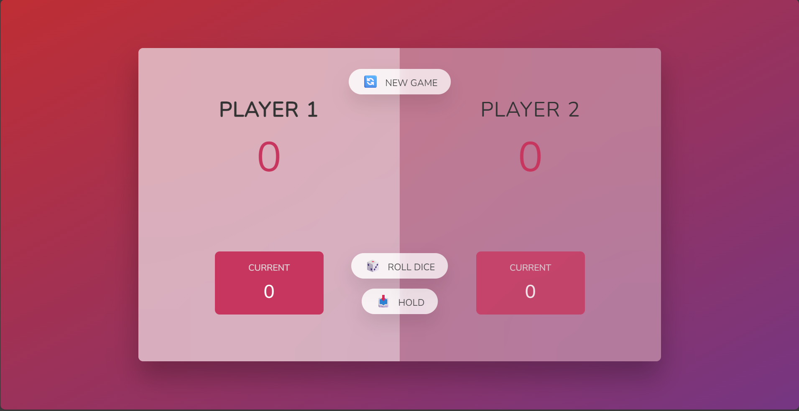
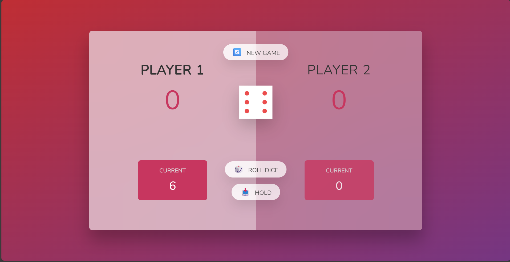
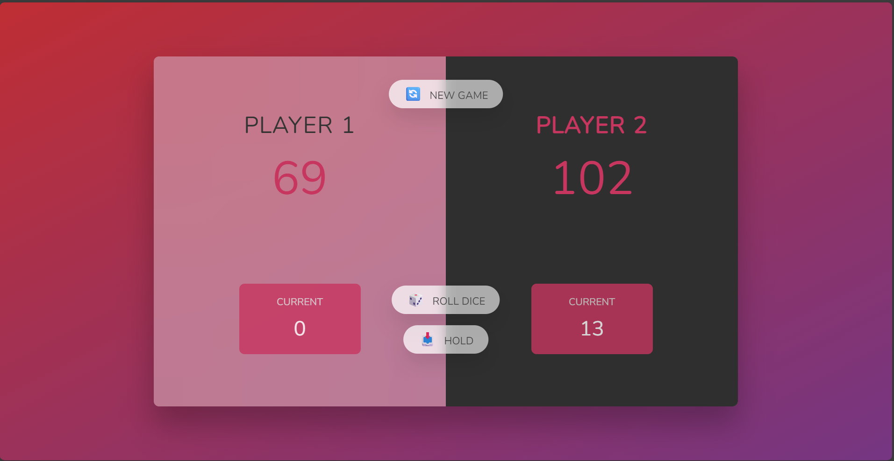

# 🎲 Dice Duels

> ℹ️ This Game was built with Reference to [JavaScript Course on Udemy](https://www.udemy.com/course/the-complete-javascript-course/?couponCode=KEEPLEARNING) for learning purposes.

<!-- Replace with the real path to your screenshot -->

A two-player dice game built with **HTML, CSS and JavaScript**.

---

## 📝 How to Play

- Two players take turns rolling a dice.
- Each roll adds the dice value to the **current score**.
- Rolling a `1` resets your current score and switches turn.
- Click **Hold** to bank your current score into your total score.
- First to reach 100 points wins!
- Click **New Game** to reset.

---

## 🚀 Live Demo

[👉 Play on GitHub Pages](https://nadeemkhan404.github.io/dice-duels-game/)  
_(Replace `yourusername` with your GitHub username)_

---

## 🛠️ Built With

- HTML5
- CSS3
- Vanilla JavaScript (no frameworks)

---

## 🧰 Key Skills & Concepts Practised

- **DOM Selection & Manipulation**
- **Event Handling**
- **State Management (currentScore, activePlayer, scores[])**
- **Conditional Logic and Ternary Operators**
- **Dynamic UI Updates** (textContent, dice images, hidden class)
- **Reusable Functions** (switchPlayer)
- **Visual Feedback** (toggle `player--active` class)
- **Planning with Flowcharts** before coding

---

## 📂 Project Structure

pig-game/
├── index.html
├── style.css
├── script.js
├── dice-1.png
├── dice-2.png
├── dice-3.png
├── dice-4.png
├── dice-5.png
├── dice-6.png
└── screenshots/
├── start.png
├── rolling.png
└── win.png

---

## 🖼️ Screenshots

| Game Start                                | Rolling Dice                                   | Winner                                    |
| ----------------------------------------- | ---------------------------------------------- | ----------------------------------------- |
|  |  |  |

---
